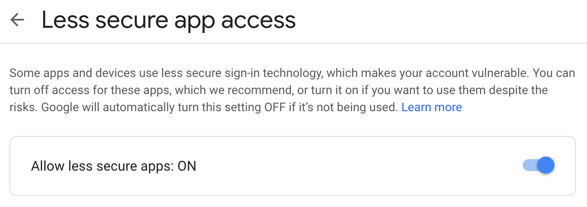

# Back End Week 2 Morning Tasks

**Don't fork this repository - create your own!**

## Prior Knowledge

- Familiarity with HTML and CSS from [Pre-course Section 3](https://github.com/northcoders/PRE-3).
- Ability to create a basic express server
- Understand how to handle asynchronous JavaScript with Promises

## Learning Objectives

- Understand traditional web architecture
- Know the benefits and limitations of using a static server
- Learn how to set up a static server with [Express](https://expressjs.com/)
- Use native HTML form behaviour to send data to your server
- Use a template engine to create some dynamically created, server-side rendered HTML
- Send an email to your own account when a user submits a form
- Manage sensitive data so that it is hidden from others
- Host your Express server

## Introduction

So far on the course, you have learnt how to create HTTP servers using Express. Usually, you have created a server that allows a client (some other computer) to request some JSON data from your server. This allows for a client application(s), or website(s), to display that data however they like - there is even the possibility for them to consume multiple APIs in a single app. During the front-end block, you will learn how to create modern [single-page applications](https://en.wikipedia.org/wiki/Single-page_application) built with [Reactjs](https://reactjs.org/docs/hello-world.html) that interact with the kinds of API that you will have already started creating. This is a really good approach for building complex, data-driven applications. However, this can sometimes be overkill.

## Task 1 - Create a Static Server

Websites that consist of a few HTML pages without complex front-end interactions can be created easily using a static server. A static server is a server that serves up content that does not change over time because of client interaction. For example, a `GET` request to `http://www.my-website.com/about.html` will cause the server running at that address to look for a file called `about.html` in a directory specified by the person who set up the server. A good example of a static server is [nginx](https://docs.nginx.com/nginx/admin-guide/web-server/serving-static-content/). There are also a bunch of services that will serve static content on our behalf, such as [GitHub Pages](https://pages.github.com/) for serving static content but we can achieve similar results using Node.

- Create an [Express](https://expressjs.com/) server.

- To allow your app to [serve up static files](https://expressjs.com/en/starter/static-files.html), use the `express.static` built-in middleware function in Express.

```js
app.use(express.static('public'));
```

Here, `'public'` refers to a directory of files that will be made available to the client. It is important that this is not the root directory of the server, as _any_ files in the directory specified will be made available.

- Create a file in the `./public` directory: `index.html`.
- Create some [boilerplate](https://en.wikipedia.org/wiki/Boilerplate_code) HTML here. Try to use [emmet](https://code.visualstudio.com/docs/editor/emmet) to make writing HTML more efficient.
- Start up your server and make a request to it using your browser:

```bash
npm run dev # you will need to create this script!
```

```http
GET http://localhost:<YOUR_PORT>/
```

This should serve up the `index.html` as this is the conventional name for a [homepage](https://www.lifewire.com/index-html-page-3466505) (you may have noticed that this convention is borrowed by NodeJS too).

- Add some style! Create a css file in the `public` directory, and link to it from your HTML:

```html
<link rel="stylesheet" href="index.css" />
```

- You can add as many static pages to your server as you like. It might be a good idea to start off with the portfolio site you created as part of pre-course section 3.
- Link from each page to other pages using [anchor tags](https://www.w3schools.com/tags/tag_a.asp). As you don't yet know where the site will be hosted, use relative paths for the [href](https://www.w3schools.com/tags/att_a_href.asp) attribute:

```html
<a href="/index.html">Go Back Home</a>
```

## Task 2 - Add a Contact Page

### Create the Form

- Create a new file: `./public/contact.html`
- Add to it an [HTML form](https://developer.mozilla.org/en-US/docs/Learn/HTML/Forms/Your_first_HTML_form) with email, subject and message fields (plus any others that you want).
- Each field should have:
  - a label associated with it (they are linked by the `for` and `id` attributes)
  - a name attribute (this will be important when we want to receive the form data)
  - a `required` attribute if the field needs to have a value before the form can be submitted

```html
<form>
  <label for="name">Name: </label>
  <input id="name" type="text" name="name" required />

  <label for="email">Email: </label>
  <input id="email" type="email" name="email" required />

  <label for="subject">Subject: </label>
  <input id="subject" type="text" name="subject" required />

  <label for="message">Message: </label>
  <textarea id="message" type="email" name="message" required></textarea>

  <button type="submit">Submit</button>
</form>
```

- Visit `/contact.html` and try submitting the form. You should see the page refresh and the url change to something like:

```
/contact?name=form-info&email=form-info&subject=form-info&message=form-info
```

This is the default behaviour of HTML forms. It will cause the browser to make a new `GET` request to the endpoint / URL in its `action` attribute (if no action attribute is specified, it will default to the current page's URL). It also appends all of the form data to the URL as a query string. Each key corresponds to the `name` attribute of an input field and the value corresponds the user's input into that field.

Rather than sending all of the (possibly sensitive) form data as a query string on a `GET` request, add some additional attributes to the form to control how it sends data:

```html
<form
  action="/contact"
  method="POST"
  enctype="application/x-www-form-urlencoded"
>
  <!-- form fields -->
</form>
```

- `action` - URL / Endpoint: Specifies where to send the form-data when a form is submitted
- `method` - GET / POST: Specifies the HTTP method to use when sending form-data
- `enctype` - Encryption type has three options: "application/x-www-form-urlencoded", "multipart/form-data", "text/plain" (sadly "application/json" is not supported).

### Get the Form Data

- Set up an endpoint to receive the form data with a controller attached.
- Log the request body in the controller.
- Try submitting the form once more.

```js
app.route('/contact').post(contact);
```

```js
exports.contact = (req, res, next) => {
  console.log(req.body);
  res.send({ msg: 'hello' });
};
```

- You might find that the form information does not exist on the request body. It will need to be parsed and added as the information arrives. Use some more [built-in middleware](https://expressjs.com/en/4x/api.html#express.urlencoded) to do this:

```js
app.use(express.urlencoded({ extended: true }));
```

- Add some error handling to your endpoint:

```js
exports.contact = (req, res, next) => {
  const { name, email, subject, message } = req.body;
  if (!name || !email || !subject || !message) {
    next({ status: 400, msg: 'Bad Request' });
  } else {
    res.send({ msg: `Thanks for contacting me, ${name}` });
  }
};
```

## Task 3 - Use a Template Engine to Serve Dynamic Content

Template engines are a way to add dynamic data into HTML templates. There are lots of [template engines](https://expressjs.com/en/guide/using-template-engines.html) available that can be used with Express. This README will use [Embedded JavaScript / EJS](https://ejs.co/) as an example - but feel free to experiment with other options!

- Install your template engine:

```bash
npm install ejs
```

- Set the template engine in the express app. Notice that the template engine (`'ejs'` here) specified as a string, so there is no need to `require` the template engine module into our code.

```js
app.set('view engine', 'ejs');
```

Whatever your choice of view engine, the templates will need to be created in a new directory in the root of the server called `views`.

- Create a "view". The file extension and way that the template is written will depend on the view engine that you have chosen (e.g. `./views/contact.ejs`).

```html
<!-- some HTML -->
<h1>Thanks for contacting me!</h1>
<p>I will get back to you shortly.</p>
<!-- some more HTML -->
```

- In your controller, use the `.render` method on the response to serve up your template as HTML.

```js
exports.contact = (req, res, next) => {
  // rest of controller...
  res.render('contact');
};
```

> Express-compliant template engines such as Pug and EJS export a function named `__express(filePath, options, callback)`, which is called by the `res.render()` function to render the template code.

- Pass some data to the template as an object:

```js
// partial controller
const { name } = req.body;
res.render('contact', { name });
```

- Alter the template to interpolate the provided data to be served up (again, this will vary massively based on the template engine you chose). Here is an example using EJS:

```ejs
<!-- some HTML -->
<h1>Thanks for contacting me, <%= name %>!</h1>
<p>I will get back to you shortly.</p>
<!-- some more HTML -->
```

There are many more powerful ways to use template engines. It is possible to iterate over arrays to produce some HTML for each element, to have a model fetch some data from a database or other source before adding it to the template, using [partials](https://medium.com/@henslejoseph/ejs-partials-f6f102cb7433) to avoid code duplication etc.

- Experiment with the different ways you can use your template engine!
- You could adjust your error handling so that it is a bit more human friendly too:

```js
app.use('/*', (req, res, next) => {
  next({ status: 404, msg: 'Page Not Found' });
});

app.use((err, req, res, next) => {
  const { msg = 'Internal Server Error', status = 500 } = err;
  res.status(status).render('error', { status, msg });
});
```

## Task 4 - Add Functionality to the Contact Form

### Set Up

We are going to make it so that when somebody submits the contact form, an email is sent to your email address. There are many different ways to send emails, but this example will use an npm package called [Nodemailer](https://nodemailer.com/about/) to send an email from a new email account to your personal one.

- Set up a new [Gmail](https://mail.google.com/mail?hl=en-GB) account.


- Once set up and logged into your new Gmail account, enable it as a [Less Secure App](https://myaccount.google.com/lesssecureapps?pli=1). This will allow you to send emails from JS using the email address and password. As the name implies, there are more secure ways of sending emails, but they are much more complicated and this will be enough for our purposes.



It is **REALLY IMPORTANT** that this sensitive information is not shared. To avoid this, we can set the email address and password as [environment variables](environment-vars.md) using another package called [dotenv](https://www.npmjs.com/package/dotenv).

- Install `dotenv`

```bash
npm install dotenv
```

### Hide Those Deets

- Create a file `.env` in the root of the project. This will contain sensitive information so make sure that it is `.gitignore`d:

```bash
touch .env
echo .env >> .gitignore
```

- Add the email address, password as well as your own email address to the `.env` file:

```
GMAIL_ADDRESS=user@gmail.com
GMAIL_PASS=supersecretpass
DESTINATION_EMAIL_ADDRESS=me@email.com
```

- Use `.dotenv` to ensure these values are set as key-value pairs on Node's `process.env`. `console.log` to confirm:

```js
require('dotenv').config();

console.log(process.env.GMAIL_ADDRESS);
```

### Send An Email From JS

- Install `nodemailer`:

```bash
npm install nodemailer
```

- Create a function that sends an email to yourself. Check that it works by running it outside of the context of your Express application:

```js
const nodemailer = require('nodemailer');

const sendMail = (name, email, subject, message) => {
  const transporter = nodemailer.createTransport({
    service: 'gmail',
    auth: {
      user: process.env.GMAIL_ADDRESS,
      pass: process.env.GMAIL_PASS,
    },
  });

  const mailOptions = {
    from: process.env.GMAIL_ADDRESS,
    to: process.env.DESTINATION_EMAIL_ADDRESS,
    subject,
    text: `${name} has messaged you from ${email}.

    ${message}
    `,
  };

  return transporter.sendMail(mailOptions);
};

sendMail('ant', 'ant@ant.com', 'greeting', 'hello!')
  .then(() => console.log('success'))
  .catch(console.log);
```

### Connecting the Form

When a user submits the form, a `POST` request will be made to the server. Use your `sendMail` function to send an email to yourself containing the user submitted details before letting them know whether their request has been successful or not.

```js
const contact = (req, res, next) => {
  const { name, email, subject, message } = req.body;
  sendMail(name, email, subject, message)
    .then(() => {
      res.status(201).render('contact', { name });
    })
    .catch(next);
};
```

## Task 5 - Host Your Site

There are lots of ways to host your server. We could buy a dedicated computer, connect it to the internet and run the server code on there but that comes with a bunch of problems:

- We have to pay for a computer.
- If there isn't much traffic to the server, we are effectively wasting the unused resources on that computer.
- If there is too much traffic to the server, we would have to buy a new computer to handle it.
- We would have to maintain that computer ourselves, making sure that it is constantly running.

Not such a good idea to do this ourselves then.

[Heroku](https://devcenter.heroku.com/articles/how-heroku-works) offers a good solution to this problem. It allows us to push up our source code using Git. Heroku installs any dependencies specified in our `package.json`, and runs the app in a "Dyno" (a lightweight, secure, virtualized Unix container). This means that our site could easily be scaled up when it, inevitably, becomes super popular. Heroku also comes with a pretty generous free tier.

Heroku has wonderful [documentation](https://devcenter.heroku.com/). You can find great guides to what we are doing there, as well as a bunch of other useful material.

### 1. Sign Up For a Heroku Account

[Sign up](https://signup.heroku.com/).

### 2. Install the Heroku CLI

On macOS:

```bash
brew tap heroku/brew && brew install heroku
```

...or Ubuntu:

```bash
sudo snap install --classic heroku
```

### 3. Create a Heroku App

Log into Heroku using their command line interface:

```bash
heroku login
```

Create an app in an active git directory. Doing this in the folder where your server exists is a good start, as this is what you will be hosting.

```bash
heroku create your-app-name
```

Here `your-app-name` should be the name you want to give your application. If you don't specify an app name, you'll get a random one which can sometimes be a bit iffy.

This command will both create an app on Heroku for your account. It will also add a new `remote` to your git repository.
Check this by looking at your git remotes:

```bash
git remote -v
```

You should see that you now have _two_ git remotes: `origin` and `heroku`

### 4. Deploy

```bash
git push heroku master
```

Preview your app:

```bash
heroku open
```

You should see an error page. There are a few extra steps we will need to follow to make sure the project is configured for hosting on Heroku. Check the logs on Heroku whenever you need to debug an error in your deployed app:

```bash
heroku logs --tail
```

### 5. Configure Your App for Deployment

After each change you make, `git add`, `git commit` with a descriptive commit message. The work should always be backed up on GitHub (`git push origin master`) so that there is less chance that work can be lost.

#### Use Heroku's PORT

Because Heroku will be running our app on a dyno, we cannot decide which port it should listen on. Heroku will provide that information to our app as an environment variable. Therefore, it will be accessible in our code on the `process.env` object, which is globally available.

The app should still work locally when we are not providing a `PORT` environment variable, so make sure there is a default value if `process.env.PORT` is `undefined`.

```js
const PORT = process.env.PORT || 9090;

app.listen(PORT, () => console.log(`Listening on ${PORT}...`));
```

#### Add a Start Script

Make sure your `package.json` has a start script that will run your express app:

```json
"start": "node file-path.js",
```

This is what Heroku will automatically run once it has installed all dependencies.

#### Specify The Node Version

Define what version of Node your app will work well with. Check which version of Node you have running on your machine.

```bash
node --version
```

You should see an output (for example: "v12.6.0"), so we know the app should work with this major version of Node. We can specify that Heroku should use this version of Node for running the app in the `package.json`:

```json
{
  "engines": {
    "node": "12.x"
  }
}
```

#### Provide Sensitive Information as Environment Variables

The `.env` file containing any sensitive information is `.gitignore`d and so will not be pushed up to GitHub _or_ Heroku. Therefore, this information will need to be provided to the app running on Heroku in some other way: [environment variables](environment-vars.md).

The Heroku CLI allows us to [set environment variables](https://devcenter.heroku.com/articles/config-vars) for the app running on Heroku.

Check the current config:

```bash
heroku config
```

Set all sensitive keys as environment variables one-by-one:

```bash
heroku config:set GMAIL_ADDRESS=user@gmail.com
```

Check whether it has worked each time:

```bash
heroku config
```

### 6. Re-deploy

Once the app is ready, re-deploy it:

```bash
git push origin master
```

### 7. Review Your App

```bash
heroku open
```

Any issues should be debugged with:

```bash
heroku logs --tail
```
